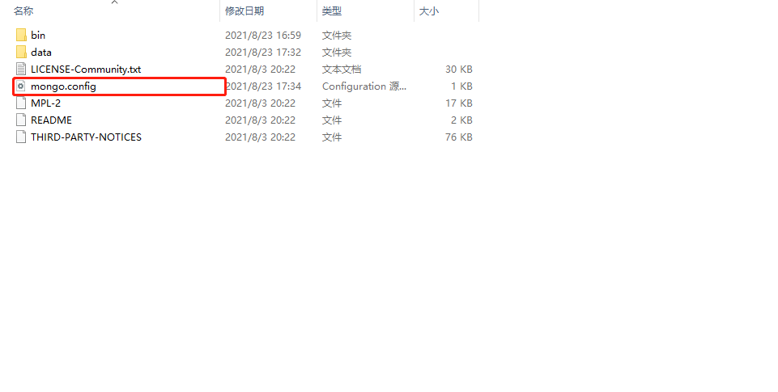
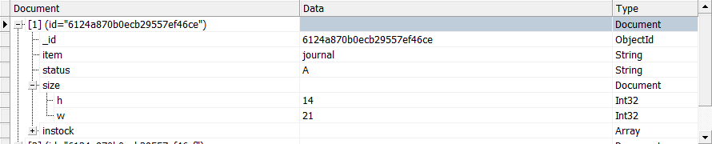
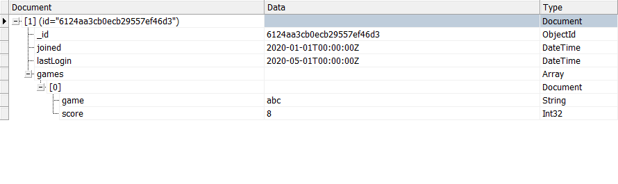

# zip包安装mongodb服务
1. 创建data目录，存放数据和日志文件

2. 添加mongodb的配置文件

文件内容如下:
```text
# 数据库路径
dbpath=D:\Develop\Mongo\mongo-data\mongodb-win32-x86_64-windows-5.0.2\data\db
# 日志输出文件路径
logpath=D:\Develop\Mongo\mongo-data\mongodb-win32-x86_64-windows-5.0.2\data\log\mongo.log
# 错误日志采用追加模式
logappend=true
# 启用日志文件(默认启用)
journal=true
# 这个选项可以过滤掉一些无用的日志信息，若需要调试使用请设置为false
quiet=true
# 端口号(默认为27017)
port=27017
```
3. 注册服务
mongod --config D:\Develop\Mongo\mongo-data\mongodb-win32-x86_64-windows-5.0.2\mongo.config --install --serviceName "MongoDB"


4. 创建超级管理员和所有数据库管理员


```text
Built-In Roles（内置角色）：
    1. 数据库用户角色：read、readWrite;
    2. 数据库管理角色：dbAdmin、dbOwner、userAdmin；
    3. 集群管理角色：clusterAdmin、clusterManager、clusterMonitor、hostManager；
    4. 备份恢复角色：backup、restore；
    5. 所有数据库角色：readAnyDatabase、readWriteAnyDatabase、userAdminAnyDatabase、dbAdminAnyDatabase
    6. 超级用户角色：root  
    // 这里还有几个角色间接或直接提供了系统超级用户的访问（dbOwner 、userAdmin、userAdminAnyDatabase）
    7. 内部角色：__system

具体角色的功能： 

Read：允许用户读取指定数据库
readWrite：允许用户读写指定数据库
dbAdmin：允许用户在指定数据库中执行管理函数，如索引创建、删除，查看统计或访问system.profile
userAdmin：允许用户向system.users集合写入，可以找指定数据库里创建、删除和管理用户
clusterAdmin：只在admin数据库中可用，赋予用户所有分片和复制集相关函数的管理权限。
readAnyDatabase：只在admin数据库中可用，赋予用户所有数据库的读权限
readWriteAnyDatabase：只在admin数据库中可用，赋予用户所有数据库的读写权限
userAdminAnyDatabase：只在admin数据库中可用，赋予用户所有数据库的userAdmin权限
dbAdminAnyDatabase：只在admin数据库中可用，赋予用户所有数据库的dbAdmin权限。
root：只在admin数据库中可用。超级账号，超级权限
```

# 使用MongoDB进行查询操作
1. Mongodb在查询的时候返回指定的列
//返回嵌套文档的特定字段(可以是嵌套的情况)
db.inventory.find({status:"A"},{status:1,item:1,"size.uom":1});


2. 禁止返回指定的列(可以是嵌套的情况)


3. $elemMatch(匹配数组符合的元素)

db.players.find({},{games:{$elemMatch:{score:{$gt:5}}},joined:1,lastLogin:1});


4. $slice()
```text
指定要在 <arrayField> 中返回的元素数。 对于 <编号>：
指定一个正数 n 以返回前 n 个元素。
指定一个负数 n 以返回最后 n 个元素。
如果 <number> 大于数组元素的数量，则查询返回所有数组元素。
```

db.inventory.find( { status: "A" }, { item: 1, status: 1, instock: { $slice: -1 } } )
执行之后


5. 嵌套文档的查询
db.inventory.find({instock:{warehouse:"A",qty:5}});

db.inventory.find({"instock":{$elemMatch:{qty:{$gt:10,$lte:20}}}});


6. 指定与和或的条件
//指定或条件
db.inventory.find({$or:[{status:"A"},{qty:{$lt:30}}]});
//指定和条件
db.inventory.find({status:"A",qty:{$lt:30}});

7. 数组元素组合满足标准
```text
上面的几个例子，对于数据的操作都是使用了$elemMatch和$slice操作符，如果对于条件不添加上面的操作符，
那么查询将选择数组包含满足条件的元素任意组合的那些文档
```
使用操作
db.inventory.find({"instock":{$elemMatch:{qty:{$gt:10,$lte:20}}}});

不使用操作符


8. 匹配数组
如果需要严格匹配元素的包括顺序
db.inventory.find({tags:["red","blank"]});

db.inventory.find({tags:{$all:["red","blank"]}});


# MongoDB进行更新操作
```text
使用$set 运算符将size.uom字段的值更新为“ cm”，将状态字段的值更新为“ P”，
使用$currentDate运算符将lastModified字段的值更新为当前日期。 如果lastModified字段不存在，则$currentDate将创建该字段。 有关详细信息，请参见$currentDate。
```
执行：
db.inventory.updateOne({item:"paper"},{$set:{"size.uom":"cm",status:"p"},$currentDate:{lastModified:true}});


